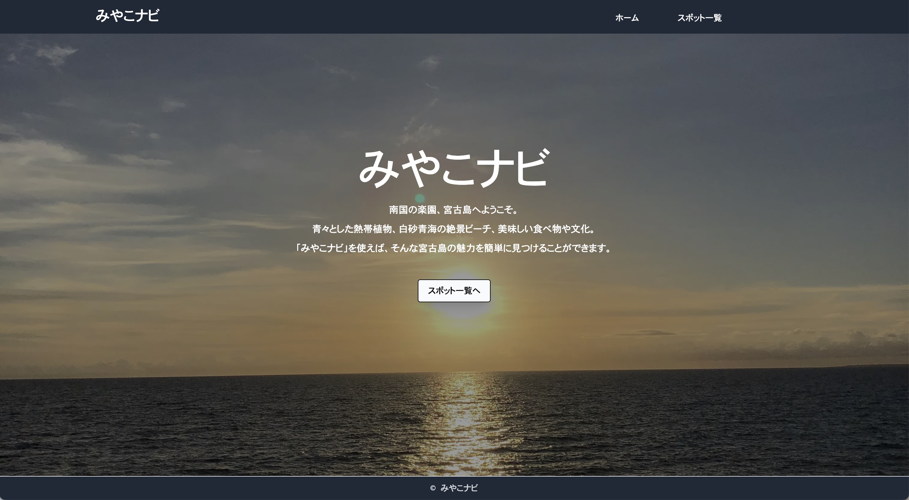
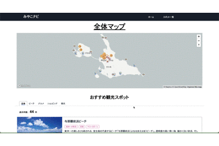

# みやこナビ

未経験からエンジニアに転職するため、ポートフォリオを作成しました。 
宮古島の観光スポットを、それぞれのジャンルごとに見つけることができます。

# 制作期間

4 月中旬から 5 月中旬にかけての 1 ヶ月

# URL

https://miyakojima-nav.vercel.app/

# 開発環境

macOS Ventura 13.3.1

# 使用技術（カッコ内はバージョン）

- Next.js(12.3.2)
- TailwindCSS(3.3.1)
- mapbox(2.14.1)
- Vercel

### そのほかの使用技術

- eslint
- prettier

# 機能、非機能一覧

- mapbox でマップ表示
  - 観光スポットをマーカーで表示
  - マーカーはスポットのジャンルごとにわかりやすく分ける
  - マーカーはクリックするとポップアップが表示される。
- レスポンシブデザイン
- react-tabs でタブ実装

# ポートフォリオを作る上でのモチベーション

- 未経験から WEB エンジニアになるためには、ポートフォリオが必須と考えたため。簡単なアプリでもいいので、まずはゼロから作ってデプロイすることにこだわりました。
- 宮古島移住の経験　ー　移住前の短期間の旅行で気づけなかった魅力がありました。移住で感じた宮古島の魅力を発信し、宮古島へ旅行に行く際に少しでも参考になれば嬉しいです。

# 工夫した部分

- 作業工程面

  - Notion を使った進捗管理　ー　技術選定や要件定義、タスク管理を行ないました。初めてのポートフォリオ作成ということもあり、始めからタスクを全て洗い出そうとするのではなく、出てきたら都度足していく方法で進めました。

- 実装面

  - mapbox でマーカーをクリックしたらポップアップが出るようにする部分
  - mapbox でジャンルごとにマーカーのアイコンを変える
  - レスポンシブデザイン
  - サイトに統一感が出るような配色

# 良かった点、反省点

- 良かった点

  - ゼロからポートフォリオを作っていくために、簡単ではあるがアプリ作成の一通りの工程を経験できた。
  - 実装していく中で、自分がやりたいことを調べて実装していく力をつけることができた。
  - 作成期間の目標を立て、その目標を達成するためにタスク分割し、実装していくことができた。

- 反省点
  - スピード重視で実装を行なったため、コードが大変見づらい。
  - 要件定義や設計、タスク設定など、実装前の準備が甘かった。実装してから気づくことや悩むことが多かったため、集中して手を動かすことができていなかった。
  - 実装段階で技術選定やアプリ機能に悩み、無駄に時間を過ごしてしまっていた。

# 改善点

- コード全体のリファクタリング
- TypeScript への移行
- DB 導入（以下は導入後に追加検討している機能）
  - 認証認可（ユーザ登録、ログイン、CRUD、レビュー）
  - 検索、並び替え機能
